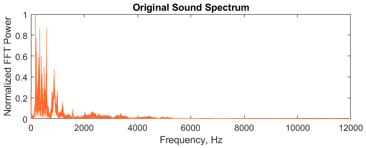
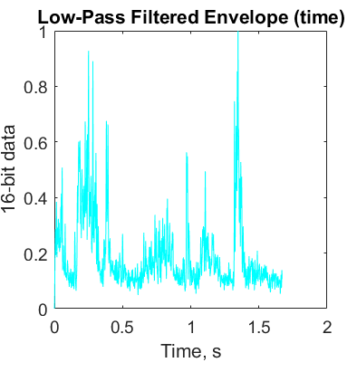
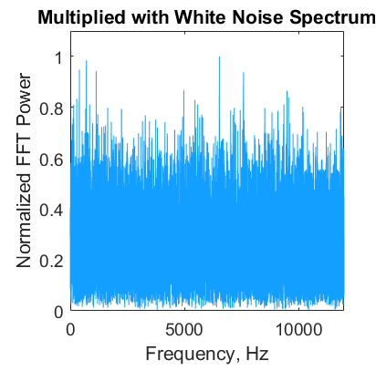
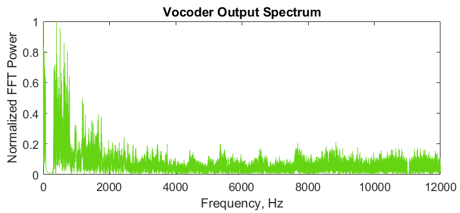
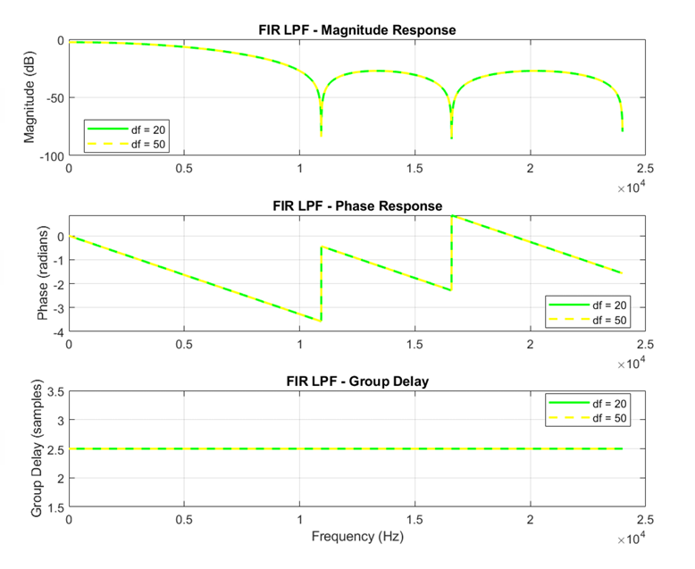
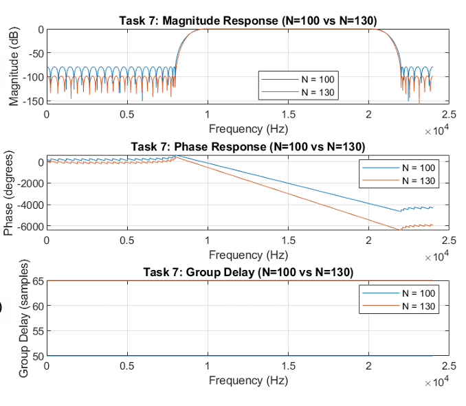
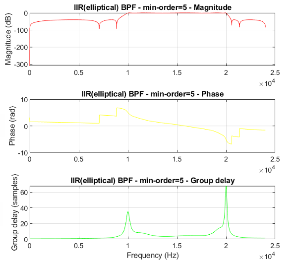

# Digital Filter Design & Speech Vocoding (MATLAB)

This repository contains an Advanced Digital Signal Processing project with two deliverables:

1) **Speech vocoder implementation** (channel vocoder using analysis/synthesis filter banks and noise carrier)
2) **Digital filter design & analysis** using MATLAB: FIR equiripple (Parks–McClellan) and IIR elliptic filters

The work focuses on interpreting **magnitude, phase, and group delay** responses, and on practical implementation trade-offs such as filter order, latency, and numerical stability.

---

## Key technical highlights

### Part 1 — Vocoder (channel vocoder)
- Input audio: `bkbe2114.wav`
- Sampling: **Fs = 22 kHz**, bandwidth analysed: **0–11 kHz**
- **12 channels** (analysis + synthesis band-pass filter banks)
- Frequency cutoffs derived from the mapping:
  \[
  f = 165.4(100.06^{x}-1)
  \]
  giving approximate cutoffs:
  **[0, 69.53, 168.28, 308.55, 507.79, 790.77, 1192.71, 1763.61, 2574.51, 3726.27, 5362.19, 7685.79, 11000] Hz**
- Envelope extraction per band:
  - **Half-wave rectification**
  - **3rd-order Butterworth LPF, fc = 160 Hz**
- Carrier: **white noise**
- Modulation: envelope × noise, then synthesis filtering and summation into final vocoded speech

### Part 2 — Digital filter design (Fs = 48 kHz)
- FIR equiripple designs (firpmord + firpm):
  - Order effects: sharper transitions + deeper stopband at higher order, but **constant delay ≈ N/2**
  - Density factor effects: **plot/grid resolution**, not the true response
- IIR elliptic designs (ellipord + ellip; also Filter Designer App with SOS):
  - Very efficient at low order (e.g., N≈4–5 meets stringent specs)
  - Nonlinear phase + frequency-dependent group delay
  - High forced orders (e.g., N=50 or N=100) show numerical/conditioning issues in code and pathological delay behaviour in the app

---
## Results snapshot

### Speech vocoder (MATLAB)

| Original (spectrum) | Envelope extraction (LPF @ 160 Hz) |
|---|---|
|  |  |
| *Baseline speech spectrum with clear low-frequency concentration and formant/harmonic structure.* | *Rectification + 160 Hz LPF yields the smooth amplitude envelope used to control the carrier.* |

| Noise carrier modulation (spectrum) | Vocoder output (spectrum) |
|---|---|
|  |  |
| *Envelope-shaped noise shows broadband energy whose amplitude follows speech dynamics.* | *Output becomes noise-like (harmonics removed) while retaining overall spectral shaping for intelligibility.* |

---

### Digital filter design (FIR vs IIR)

| FIR: density factor comparison (df=20 vs df=50) | FIR: min order vs N=100 (magnitude/phase/group delay) |
|---|---|
|  |  |
| *df=20 and df=50 overlap → density mainly affects grid/plot resolution, not the true response.* | *Higher FIR order improves selectivity/attenuation but increases constant group delay (≈ N/2).* |

| FIR: order sweep (N=100 vs N=130) | IIR elliptic: min-order bandpass (nonlinear phase & delay peaks) |
|---|---|
|  |  |
| *N=130 gives slightly sharper skirts/deeper stopband than N=100, with higher constant delay.* | *Low-order elliptic IIR is magnitude-efficient but shows frequency-dependent delay (nonlinear phase).* |

**Takeaway:** FIR ⇒ linear phase + predictable constant delay; IIR elliptic ⇒ lower order for sharp magnitude specs but nonlinear phase/delay variation; vocoding preserves intelligibility via envelope extraction and noise-carrier modulation.

## Repository layout
- `src/` — MATLAB source code (vocoder + filter design)
- `docs/` — detailed write-ups per part + full report PDF
- (Optional) `results/figures/` — exported plots used in docs
- (Optional) `data/audio_in/` and `data/audio_out/` — short audio samples

---

## How to run

### Requirements
- MATLAB (R20xx or later recommended)
- Signal Processing Toolbox (for `firpm`, `firpmord`, `ellip`, `ellipord`, `freqz`, `grpdelay`, etc.)

### Run the vocoder
1. Place `bkbe2114.wav` in the same folder as `src/vocoder/vocoder_main.m` **or** update the path inside the script.
2. In MATLAB, set the repo root as Current Folder.
3. Run:
   - `src/vocoder/vocoder_main.m`
4. The script:
   - plays the original and vocoded audio (`soundsc`)
   - generates time + spectrum plots at key pipeline stages

### Run the filter design tasks
1. In MATLAB, set the repo root as Current Folder.
2. Run:
   - `src/filter_design/run_all_filter_tasks.m`
3. The script should generate responses (magnitude/phase/group delay) for the FIR and IIR tasks.

---

## Documentation
- Vocoder pipeline & results: `docs/vocoder.md`
- FIR/IIR design tasks & conclusions: `docs/filter-design.md`
- Methodology and assumptions: `docs/methodology.md`
- Limitations & improvements: `docs/limitations.md`
- References: `docs/references.md`
- Full academic report: `docs/report.pdf`

---

## Notes to reviewers
This project emphasizes **engineering interpretation**:
- Why FIR order increases stopband rejection but adds latency
- Why density factor changes visual smoothness rather than filter behaviour (FIR equiripple)
- Why high-order elliptic IIR designs become ill-conditioned in direct coefficient form, and why SOS helps (but can still be impractical)
